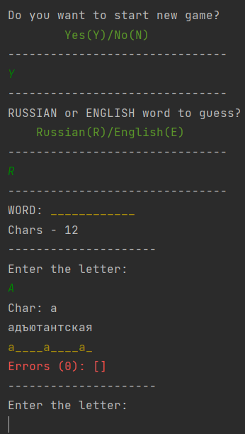
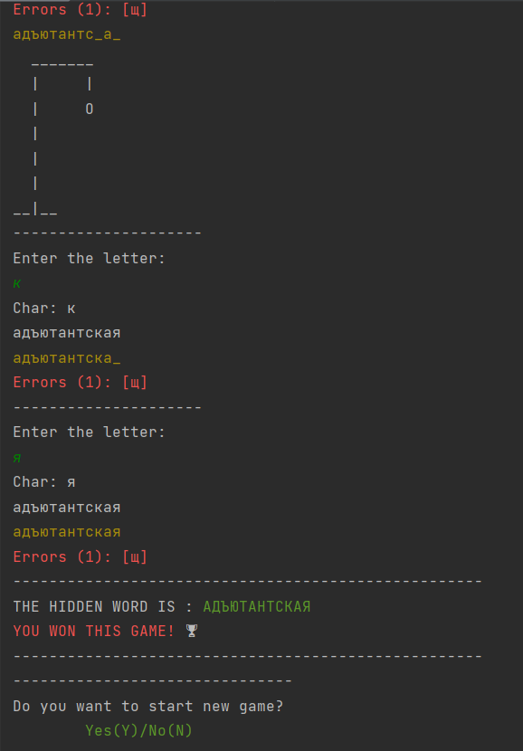

# Hangman (Виселица)

Основная ___задача___ данного проекта - реализация игры "Виселица" на языке ___Java___. Интерфейс - консольный. С основными правилами игры можно ознакомиться - [Википедия](https://ru.wikipedia.org/wiki/%D0%92%D0%B8%D1%81%D0%B5%D0%BB%D0%B8%D1%86%D0%B0_(%D0%B8%D0%B3%D1%80%D0%B0)).

## Пример работы


При входе в приложение и его запуске, пользователь выбирает слово для угадывания. Доступны - ___Русский___ и ___Английский___ словарь.
Интерфейс программы реализован на ___Английском языке___.



При завершении программы пользователь видит результат игры
(___Победа___ или ___Поражение___), количество ___ошибок___ за игру и рисунок виселицы. В конечном итоге пользователь может ___заново___ запустить игру.


## Использование
Клонировать репозиторий:
```sh
$ git clone https://github.com/EvgenVoit/hangman
```

## Источники
[Java-backend-learning-cource](https://zhukovsd.github.io/java-backend-learning-course/Projects/Hangman/) - ___источник проекта___. 